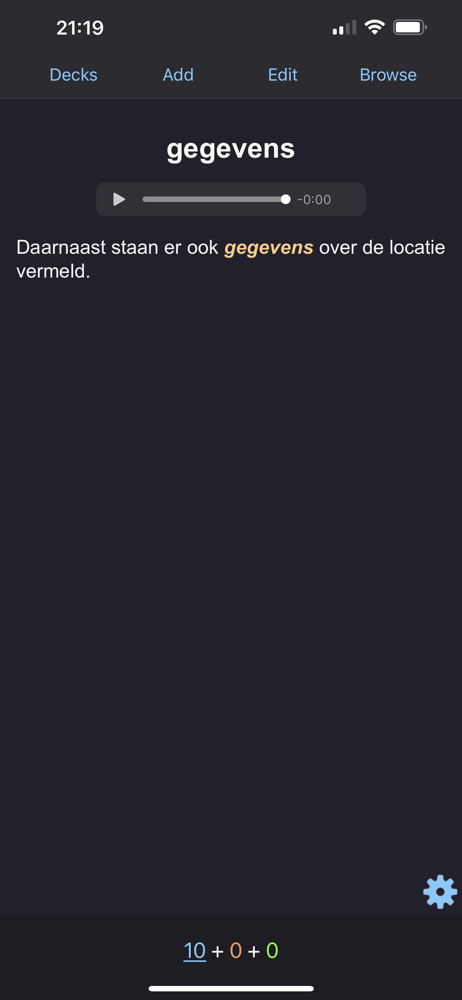
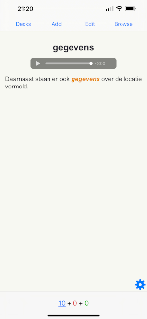
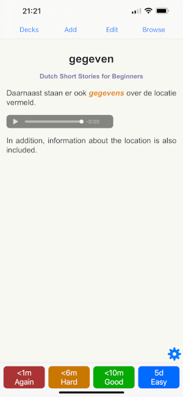

# vocabulary-to-anki

Export Kindle Vocabulary Builder to Anki cards

## Highlights

- Fetches lookups from `Kindle Vocabulary Builder` by books
- Creates `Anki Decks` based on source language
- Adds `Text To Speech` for cards (using `Google Cloud`)
- Adds `translation` for cards (using `Google Cloud`)
- Automatic `Day/Night` color scheme

 
 

## Prerequisites

Before using the library, make sure you have Google Cloud `Text-to-Speech`, `Translation` API's enabled and `gcloud CLI` installed and configured.
Please find installation instructions on follow links

- https://www.npmjs.com/package/@google-cloud/text-to-speech
- https://www.npmjs.com/package/@google-cloud/translate
- https://cloud.google.com/sdk/gcloud

## Usage

```bash
npx vocabulary-to-anki
```
